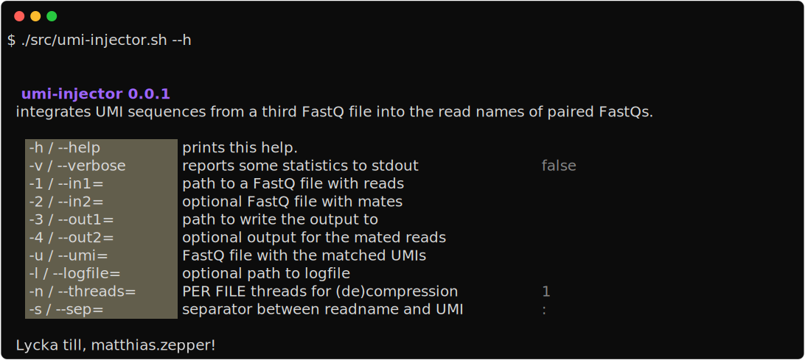

# UMI Injector

**umi-injector** integrates UMI sequences from a separate FastQ file into the read headers of a single or paired FastQ.

## Run umi-injector

Essentially, **umi-injector** is just a bash script that wraps the tools `awk`, `pigz` and `file`. Unless you run the containerized version, those need to be installed on your system.

You must at least provide three arguments:  `--in1`, `--out1` and `--umi` (or their equivalent shorthands `-1`, `-3` and `-u`).:

```bash
umi-injector.sh --in1="./test_data/read1.fastq.gz" --umi="./test_data/umi.fastq.gz" --out1="./test_data/read1_umi.fastq.gz" 
# equivalent to
umi-injector.sh -1 ./test_data/read1.fastq.gz -u ./test_data/umi.fastq.gz -3 ./test_data/read1_umi.fastq.gz
```


Whatever DNA sequence is provided as `--umi` will be integrated into the header of the reads in `--in1`. You can provide both, compressed and uncompressed input & output and even mix both arbitrarily.

The script will run a few basic validators on the provided arguments, but not corroborate matching read IDs. Thus, ensure that the files are sorted in a consistent order, otherwise the wrong UMIs will be integrated into the reads!


You can specify `--sep=` to choose a different UMI separator than the default colon. For [umi-tools dedup](https://umi-tools.readthedocs.io/en/latest/), you will, for example, need to separate UMIs by an underscore.

`--threads` will set the number of cores used by **each** pigz compression process. For every compressed file that you write, this number of threads will be used. Processes for reading compressed files will never use more than one thread, since there is no advantage of doing so.

*umi-injector* is ideally run with 6 or more `task.cpus`. One thread is needed for the awk process, 3 threads for decompressing files and 2 for compression. Any further CPUs can be utilized to accelerate the two compression processes. A total of 8 `task.cpus` for example allows you to set `--threads=2`.

The possible setting $t$ for the number of `--threads` can be calculated from the available `task.cpus` $c$ as follows:

$$ t = 1 + \left( \left\lfloor \frac{c-6}{2}\right\rfloor \left( 1 - \left\lfloor \frac{2}{1 + 2 ^{c - 8}}\right\rfloor\right) \right)$$


`--logfile` allows you to output a small log file in JSON format. The log will comprise the number of records processed and a sample header to assess the introduced changes. At the moment, `--verbose` just prints the runtime to the console.

```bash
umi-injector.sh --in1=./test_data/read1.fastq.gz --in2=./test_data/read1.fastq.gz --umi=./test_data/umi.fastq.gz --out1=./test_data/read1_umi.fastq.gz --out2=./test_data/read2_umi.fastq.gz --sep="_" --logfile="./logfile.json" --threads="2" -v
```


To print all available options and defaults to the console, run  `--help` or `-h`.



## Building the containerized versions

### Building locally

To build the image locally, Docker (e.g. [Docker Desktop](https://docs.docker.com/desktop)) needs to be installed on your system. You can build the CPU version of the image directly off this Git repository. Specify a tag name with the `-t` parameter.

```bash
docker build https://github.com/NationalGenomicsInfrastructure/umi-injector.git -t umi-injector
```

Alternatively, you can also clone this repository beforehand

```bash
git clone https://github.com/NationalGenomicsInfrastructure/umi-injector.git && cd umi-injector
docker build . --file Dockerfile -t umi-injector
```

### Building on Github Actions

This repository also contains a Github Action workflow to build the container image.

To run the workflow successfully, you need to fork the repository and create your own repository secrets. Navigate to *Settings* and then to *Secrets*, where you need to create the two secrets `DOCKERHUB_USERNAME` and `DOCKERHUB_TOKEN`. Both will be needed by the workflow to upload the finished container image to Docker Hub.  

The workflow can be dispatched manually in the *Actions* tab. Choose the desired settings in the dialogue and launch the workflow run.

### Running containerized umi-injector

To run the containerized version of umi-injector, invoke the container like so

```bash
docker run --rm -itv $(pwd):$(pwd) -w $(pwd) umi-injector
```

Replace `umi-injector` with whatever tag you specified to the `-t` parameter when building the container image.

To simplify the invocation, you can also declare an alias, which can be perpetuated in your `~/.bashrc` respectively `~/.zshrc`.

```bash
alias umi-injector="docker run --rm -itv $(pwd):$(pwd) -w $(pwd) umi-injector"
```

## License

The code is released under the MIT License and so are the contents of this repository. See [LICENSE](LICENSE) for further details.
